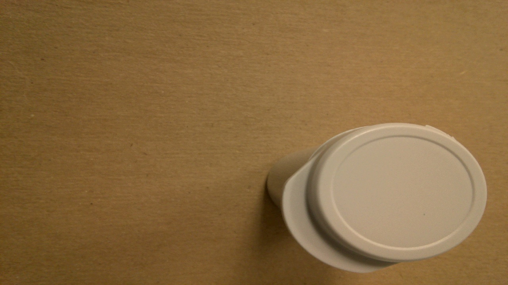
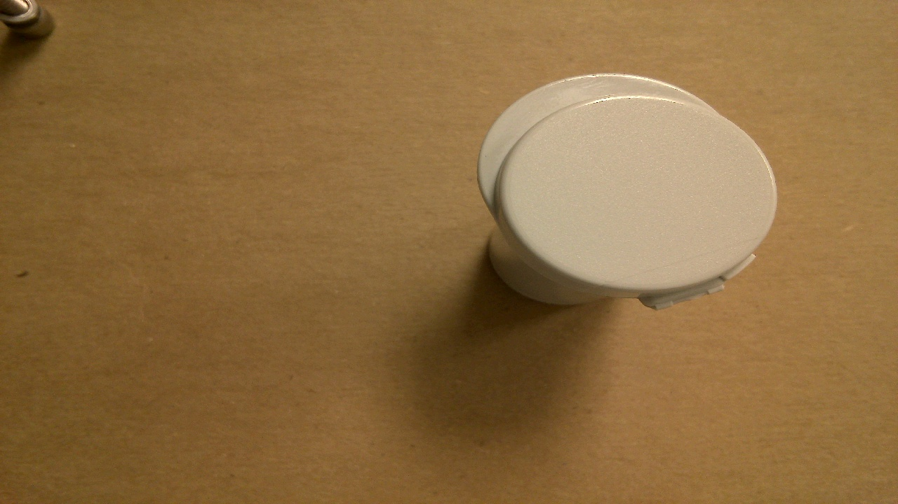

# Vial_Inspection
This repository contains all the necessary code for a Vial Recognition Application. 

## Background
The application consists in identifying between 2 vials and no vial. This model to be displayed in this repository was trained to identify between 3 clasess. These clasess are:

* Airnob Vial
* CSP Vial
* Nothing

#### Airnob Vial
 This vial looks as follows: 
 
#### CSP Vial
 This vial looks as follows:
 

#### Nothing
This type of image looks as follows:

 

## Repository Contents
The contents of this repository are :
  * Train Folder : this top_view_vials_002 folder contains three (3) subdirectories: airnob, csp, and nothing. 
  * Test Folder : this top_view_vials_002_test folder contains two (3) subdirectories (airnob, csp, and nothing) with image data for you to forward pass (test) the model
  * VialRecognition_CNN.py : this python script file contains the code where the model is trained. Here the bias and weight parameters of the model get updated through the epochs
  * VialCNN.pth : This is the already trained model. This model has the best accuracy
  * Vial_Recognition_Application_Run.py : This python scrip file is a program that prompts the user to select a folder by openning an Open Dialog Box window. Select either top_view_vials_002 or top_view_vials_002_test folders to proceed with the program. After selecting either of these folders located in this repository, the program will output a matplotlib plot that shows 5 images with their predictions alongside
  * Vial_CNN_test.pth: This is just a dummy model. The VialRecognition_CNN.py will overwrite this model when this py file runs
  * Vial Recognition Live.py: This is a program used in one of the videos that is part of this repository submission. In the video I am running my program live and I am presenting my Jetson nano-camera system with the different vials that I used for trainning this model. The live program is capable of identifying correctly the vials that I present to the jetson nano-camera system.
  * Sample images: These are airnob.jpg, csp.jpg and nothing.jpg
  * Functions: two (2) py file scripts are turned into modules that contain functions for my other programs to work. These py files are; namely:   utils_dlinano.py and DirectoryFunctions.py

## Set-up
If you will be running this from a x64 or x86 processor architecture (laptop or desktop computers), follow these steps:
Download the latest version of miniconda that matches your system.

|   | Linux	| Mac	| Windows|
----|-------|-----|--------|
64-bit |	64-bit (bash installer) |	64-bit (bash installer)|	64-bit (exe installer)|
32-bit	| 32-bit (bash installer)		|       |32-bit (exe installer) 


Install miniconda on your machine. Detailed instructions:

* Linux: https://conda.io/projects/conda/en/latest/user-guide/install/linux.html
* Mac: https://conda.io/projects/conda/en/latest/user-guide/install/macos.html
* Windows: https://conda.io/projects/conda/en/latest/user-guide/install/windows.html

### Create and Activate the Environment
For Windows users, these following commands need to be executed from the Anaconda prompt as opposed to a Windows terminal window. For Mac, a normal terminal window will work.

**Git and version control**

These instructions also assume you have `git` installed for working with Github from a terminal window, but if you do not, you can download that first with the command:

```
conda install git

```

**Now, we're ready to create our local environment!**

 First: Clone the repository, and navigate to the downloaded folder. This may take a minute or two to clone due to the included image data.
```
git clone https://github.com/alvarolo1234619/Vial_Inspection.git
cd Vial_Inspection

```
 Second: Create (and activate) a new environment, named `VialRecognition` with Python 3.6. If prompted to proceed with the install `(Proceed [y]/n)` type y.
 
  ##### Linux or Mac:
  ```
  conda create -n VialRecognition python=3.6
  source activate VialRecognition
  ```
  ##### Windows:
   ```
  conda create --name VialRecognition python=3.6
  activate VialRecognition
  ```
 
 At this point your command line should look something like: `(VialRecognition) <User>:VialRecognition <user>$`. The `(VialRecognition) `   indicates that your environment has been activated, and you can proceed with further package installations.
 
 Third: Install PyTorch and torchvision; this should install the latest version of PyTorch.
 
  ##### Linux or Mac:
  ```
  conda install pytorch torchvision -c pytorch 
  
  ```
  ##### Windows:
   ```
  conda install pytorch -c pytorch
  pip install torchvision
  
  ```
 
 Fourth: Install a few required pip packages, which are specified in the requirements text file (including OpenCV).
   ```
  pip install -r requirements.txt
  
  
  ```
  
 *You are done installing these modules and basically setting up to run in a computer or laptop*.


## Test project from a computer or laptop

### Train model
For more detail on how to train a model using the **VialRecognition_CNN.py** file  please watch the following YouTube video : https://youtu.be/lKHl0BMO2YA 

### Testing


